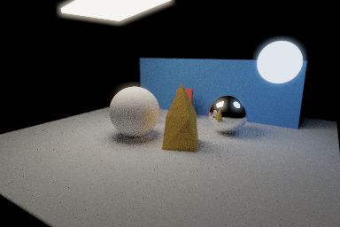
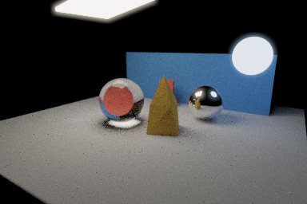
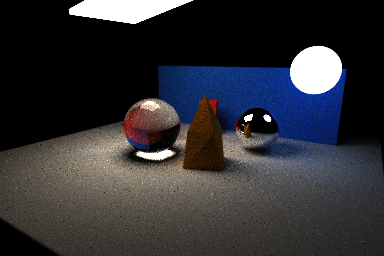

# CUDA Light Gallery

**Rithik Rajaram**


Glass bends the view behind it. A mirror sphere reflects the surrounding scene. A gold sculpture catches warm light against a blue backdrop. CUDA Light Gallery brings these materials together in a GPU renderer with adjustable focus, motion blur, and glowing highlights.

Explore a scene by moving the camera and watching the image refine as more samples arrive. Save a finished image, or save your progress and continue a longer render later. Individual features can be switched on and off in the scene file to see how they affect both the picture and rendering time.

The cover is an actual render of [the gallery scene](scenes/gallery.json), at **480 x 320 pixels and 1,024 samples per pixel**. Samples are repeated light-path estimates for each pixel; more samples generally reduce grain, at the cost of more rendering time. The scene defaults to 512 samples; the cover used the `--samples 1024` override.

## What to look for

| In the gallery | What the renderer adds |
| --- | --- |
| Glass sphere on the left | Light passes through and bends, while some reflects from the surface. Reflections become stronger at shallow viewing angles. |
| Mirror sphere on the right | Clear reflections of the lights, sculpture, and surroundings. |
| Gold sculpture in the center | An imported OBJ model with flat faces that catch light differently. |
| Warm and cool lights | Lighting sampled directly from the scene's emitting objects, alongside light bouncing between surfaces. |
| Focus and movement | A camera aperture creates depth of field; moving objects are sampled over the shutter interval to create motion blur. |
| Bright highlights | Bloom adds a soft glow, and tone mapping brings bright and dark values into the displayed image. |

The gallery combines these effects in one scene. [The mesh stress scene](scenes/mesh-stress.json) uses a larger torus model to examine the cost of rendering more triangles. Camera, materials, object placement, and rendering settings are stored in readable JSON scene files; [the settings guide](docs/FEATURES.md) explains how to change them.

## Features and results

These comparisons show the same gallery scene at **384 x 256 pixels and 128 samples per pixel**, with the same camera and random seed. Each variation changes one setting from the full-feature render.

| All features | Glass replaced with a matte material | Motion frozen |
| --- | --- | --- |
|  |  |  |

Look at the left sphere to see the difference between transmitting light and shading an opaque surface. Freezing motion removes the blur caused by the moving object's travel during the exposure.

| Direct light sampling disabled | Camera aperture disabled | Display processing disabled |
| --- | --- | --- |
|  |  |  |

Direct light sampling gives rays a deliberate chance to find a light, helping reduce noise. Turning it off still produces lighting through ordinary path bounces. Disabling the aperture removes lens blur; disabling display processing removes bloom and the brightness transforms used for the finished view.

The rendering improvements also include **scrambled Halton sampling**, which spreads samples more evenly, and **stochastic antialiasing**, which samples across each pixel to represent edges more smoothly.

## Making the work count

The renderer includes several ways to manage the work behind an image:

- **Russian roulette:** ends some paths after they contribute little remaining light, compensating surviving paths so this termination step does not bias the result.
- **Shared-memory stream compaction:** removes finished paths from the working queue so later steps process a smaller set.
- **Material sorting:** groups paths by the material they hit, so similar shading work runs together.
- **OBJ bounding-box culling:** checks whether a ray can reach a model before testing its individual triangles.

These settings are toggleable for comparison. Sorting, compaction, and mesh culling preserve the raw rendered result, but their overhead means they do not always make every scene faster.

In the measured torus scene, bounding-box culling reduced the recorded rendering-stage time by **33.3%**, with identical raw output. In the separate sampling comparison, Halton reduced image error by **27.3%** relative to independent random samples. These are results for the documented scenes and runs, rather than universal speed or quality claims.

Measurements were collected on Windows with an **NVIDIA T1000, CUDA 13.3, and Visual Studio 2022 Release builds**. The renderer recorded per-sample timings and surviving-path counts; those records were used to generate the charts. The images were rendered by this implementation.

For the details, see [measured performance, charts, and image comparisons](docs/PERFORMANCE.md). For implementation choices, supported settings, limitations, and possible improvements, see [the feature guide](docs/FEATURES.md).

## Run it in Visual Studio

You will need an NVIDIA GPU with a compatible driver, the CUDA Toolkit, CMake 3.24 or newer, and Visual Studio 2022 with C++ development tools. The Windows configuration was validated with CUDA 13.3.

First, generate the Visual Studio solution. Run this once from the repository folder in a terminal:

```powershell
cmake -S . -B build -G "Visual Studio 17 2022" -A x64
```

Then build and run in the IDE:

1. Open `build/cis565_path_tracer.sln` in Visual Studio.
2. Select **Release** and **x64** in the toolbar.
3. Set **cis565_path_tracer** as the startup project.
4. Open its **Properties > Configuration Properties > Debugging**. Set **Command Arguments** to `scenes/gallery.json` and **Working Directory** to the repository folder. With this build layout, `$(SolutionDir)..` points to that folder.
5. Build the solution and press **Ctrl+F5** to run it.

To use the cover's sample count, set Command Arguments to `scenes/gallery.json --samples 1024`. Moving the camera starts a new accumulation for the new view.

| Control | Action |
| --- | --- |
| Left mouse drag | Orbit the camera |
| Right mouse drag | Zoom in or out |
| Middle mouse drag | Pan the view |
| Space | Recenter the camera's look-at point |
| S | Save PNG and HDR images |
| C | Save a checkpoint of the current progress |
| Escape | Save the image and checkpoint, then exit |

## Save now, continue later

A checkpoint stores the sample count, camera, and accumulated image, so a render can continue from where it stopped. In the documented restart comparison, stopping at 41 samples and resuming to 128 produced exactly the same raw result as rendering all 128 samples uninterrupted.

For an offline render without the preview window, run these commands from the repository folder after building:

```powershell
build/bin/Release/cis565_path_tracer.exe scenes/gallery.json --headless --samples 256 --output build/gallery --checkpoint build/gallery.checkpoint
build/bin/Release/cis565_path_tracer.exe scenes/gallery.json --headless --samples 1024 --resume build/gallery.checkpoint --output build/gallery-resumed
```

The first command renders 256 samples and saves progress. The second continues to **1,024 total samples**, including the restored 256. Keep the scene and rendering settings the same when resuming. You can use the same arguments in Visual Studio; omit `--headless` to show the preview.

PNG files contain the processed view shown by the renderer. HDR files preserve averaged linear light values for further editing. A checkpoint stores unfinished rendering progress rather than just a viewable image.

Output directories must already exist. Explicit output prefixes overwrite matching images; default image names include a timestamp, sample count, and save counter.

<details>
<summary>Terminal build and measurement options</summary>

You can also build and run the same Release configuration from a terminal:

```powershell
cmake --build build --config Release --parallel 4
build/bin/Release/cis565_path_tracer.exe scenes/gallery.json
```

`--checkpoint-every N` saves progress every N samples. `--raw FILE` exports the unaveraged RGB float accumulation. `--stats FILE.csv` records CUDA-event stage timings and surviving paths after each bounce. Rendering feature switches are configured in the scene's `Renderer` object; see [the settings guide](docs/FEATURES.md).

</details>

## Render validation

The renderer was run with different feature settings, and its saved images and raw light values were compared.  Separate stopped, resumed, and uninterrupted runs were used to compare checkpoint results. The documented renders and measurements used the Windows Release build.
