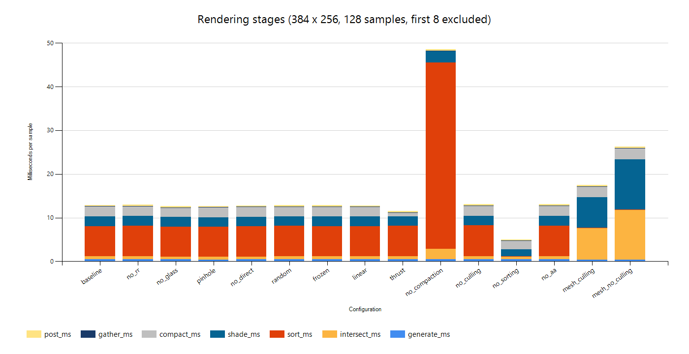
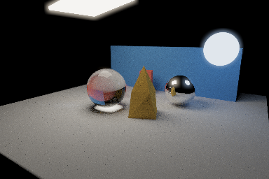
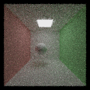
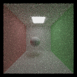
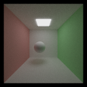
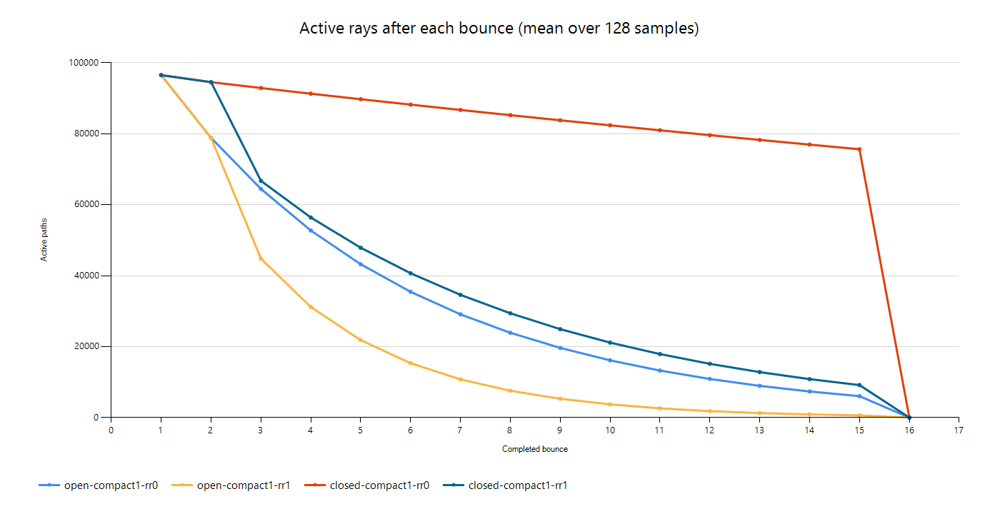
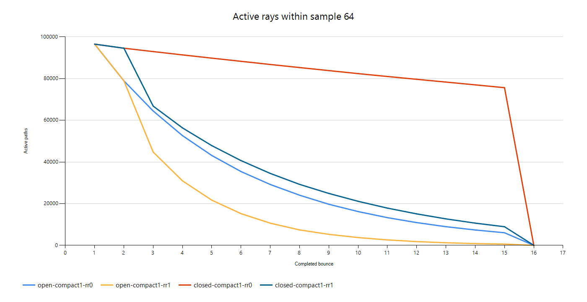
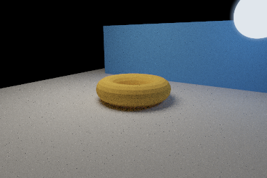
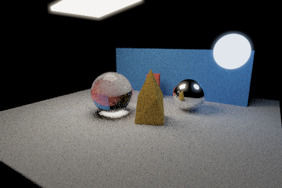

# Measured results

Measured on October 1, 2026 using an NVIDIA T1000, driver 596.86, Windows, CUDA 13.3.33, and Visual Studio 2022 Release builds.

The benchmark uses 384 x 256 pixels and 128 samples per case. Stage averages exclude the first 8 samples. Gallery depth is 12; open/closed Cornell depth is 16. Each configuration is one run, without confidence intervals. WDDM scheduling and clock/load variation affect these measurements.

**Timing scope:** CUDA events measure camera generation, intersection, material sorting, shading, compaction, final gather, and display processing. The stage sum includes launch/scheduling gaps within each event interval and the display-copy synchronization. It excludes scene loading, file writes, the raw accumulation host copy, the diagnostic alive-count reduction, and synchronization gaps between stages. It is not total wall time or an isolated Nsight kernel profile. The rendering pipeline includes explicit synchronization calls.

The renderer produced per-sample CSVs with `--stats FILE.csv`. Stage averages exclude the first eight samples; Windows .NET charting produced the stacked timing and active-ray plots. The tables below contain the measured timing summaries and sampling error; the plots show the stage breakdown and surviving-path counts. All images were rendered by this implementation.

## Gallery feature comparisons

Every case changes one setting from the same scene, camera, seed and sample count. Features such as glass, lens and shutter change the intended image. Acceleration settings should preserve it.

| Configuration | Stage sum, ms/sample | Interpretation |
| --- | ---: | --- |
| All enabled | 12.929 | Reference configuration. |
| Roulette disabled | 12.964 | Traces more low-throughput paths; see open/closed rooms below. |
| Refraction disabled | 12.643 | Glass becomes diffuse, changing the transport problem as well as cost. |
| Pinhole camera | 12.708 | Removes lens sampling and changes scene focus. |
| Direct lighting disabled | 12.801 | Removes explicit shadow queries; compare variance as well as time. |
| Independent random samples | 12.863 | Hash sampling avoids scrambled radical-inverse arithmetic. |
| Motion frozen | 12.881 | Changes intersections and coherence along with the image. |
| Post-processing disabled | 12.810 | Removes bloom and display transforms; raw output stays identical. |
| Thrust compaction | 11.510 | Library baseline for the shared-memory scan. |
| No compaction | 48.601 | Keeps dead paths in the queue; intersection/shading skip them. |
| No mesh culling | 13.096 | Small gallery mesh; the larger OBJ comparison is below. |
| No material sorting | 5.049 | Removes key sorting and paired gathers. |
| Pixel-center sampling | 13.058 | Removes subpixel jitter; changes edge coverage. |

Disabling sorting changes the measured stage sum by -60.9% relative to the sorted baseline. Sorting groups materials to reduce divergent BSDF work, but the sort and gather have their own cost. These simple material branches do not guarantee that grouping repays that cost. The stage plot separates sorting from shading so the tradeoff is visible.

The [README](../README.md#features-and-results) shows glass, lens, direct-light, motion and display comparisons. Other pairs follow.

| Roulette enabled | Roulette disabled |
| --- | --- |
|  |  |

| Shared compaction | No compaction | Thrust compaction |
| --- | --- | --- |
|  |  |  |

| Sorted | Unsorted | Pixel-center sampling (no AA) |
| --- | --- | --- |
|  |  |  |

## Sampling error

The diffuse Cornell comparison uses 128 x 128 pixels, depth 8, direct lighting and no roulette. Both candidates use 32 samples and seed 1. The independent reference uses 2,048 samples and seed 29. Error is computed in linear RGB before display processing.

| Sampler | Linear RGB MSE |
| --- | ---: |
| Independent hash | 0.0020077718 |
| Scrambled Halton | 0.0014590136 |

Halton changes MSE by -27.3% relative to independent samples in this scene/seed comparison. The finite reference also contains noise; this is evidence for this comparison, not a universal sampler ranking.

| Random, 32 spp | Halton, 32 spp | Reference, 2,048 spp |
| --- | --- | --- |
|  |  |  |

## Open versus closed scenes

Each iteration starts with 98304 camera paths. The second plot shows sample 64, satisfying the within-one-iteration comparison; the first averages all samples. The closed room adds a front wall, with the camera inside. The final drop at bounce 16 is the depth limit.

| Scene / roulette | Mean after bounce 1 | Bounce 4 | Bounce 8 | Bounce 15 |
| --- | ---: | ---: | ---: | ---: |
| open-compact1-rr0 | 96548 | 52740 | 23908 | 6040 |
| open-compact1-rr1 | 96548 | 31158 | 7562 | 618 |
| closed-compact1-rr0 | 96548 | 91316 | 85267 | 75654 |
| closed-compact1-rr1 | 96548 | 56406 | 29402 | 9162 |

| Scene | No compaction, RR off | No compaction, RR on | Shared compaction, RR off | Shared compaction, RR on |
| --- | ---: | ---: | ---: | ---: |
| open | 10.210 | 8.853 | 18.392 | 12.482 |
| closed | 14.210 | 11.257 | 43.620 | 21.385 |

Values are ms/sample. Open-room paths can escape early; closed-room paths tend to continue until hitting a light or reaching the depth limit. Roulette creates additional terminated paths, especially in the closed room. Compaction shrinks later queues but adds scan launches and host count transfers. Since the uncompacted baseline already skips dead paths in intersection and shading, compaction is not guaranteed to win on these inexpensive scenes.

## OBJ bounding-box culling

The stress scene uses an original torus with 512 quads, triangulated into 1,024 triangles. Sorting is disabled to emphasize traversal. AABB misses skip all triangles; hits still use a linear triangle loop.

| Culling on, ms/sample | Culling off, ms/sample |
| ---: | ---: |
| 17.492 | 26.244 |

Enabling culling changes the stage sum by -33.3% relative to the unculled case. Raw outputs are byte-identical. A per-mesh BVH would also reduce work for rays that enter the bounds.

| Culling enabled | Culling disabled |
| --- | --- |
|  |  |

## Checkpoints and render comparisons

The display comparison below uses 480 x 320 pixels: render 128 samples uninterrupted, or stop at 41 and resume to 128. The saved raw buffers from the uninterrupted and resumed runs were byte-identical.

| Stopped at 41 samples | Uninterrupted, 128 samples | Resumed to 128 samples |
| --- | --- | --- |
|  |  |  |

At the same 480 x 320 resolution, one checkpoint save took 4.5425 ms and one load took 3.5173 ms; the final file is 1843561 bytes. These are single I/O observations, not throughput confidence intervals. Checkpointing happens between iterations and is outside the stage timings. Save periodically to balance I/O against lost work.

| Integrator, 32 x 24 at 2,048 spp | Mean linear radiance |
| --- | ---: |
| Direct lighting + MIS | 0.13121949 |
| BSDF-only | 0.13187515 |
| Direct lighting + MIS + roulette | 0.13130050 |

The recorded mean light values differ by 0.497% between MIS and BSDF-only rendering, and by 0.062% between roulette and fixed-depth rendering. These render comparisons show close agreement for this scene and sample count.

The comparisons were generated by running the renderer with individual features enabled or disabled and saving the resulting images and raw light values. Glass, camera aperture, object motion, and display processing change the intended image. Sorting, compaction, and mesh culling produced identical raw output in the compared runs; display processing also left the raw accumulation unchanged. The checkpoint comparison used a stopped render, a resumed render, and a separate uninterrupted run.

The reported renders and measurements used the Windows Release build.

Feature-specific implementation choices, GPU-versus-CPU tradeoffs, limitations and further optimizations are in [FEATURES.md](FEATURES.md).
